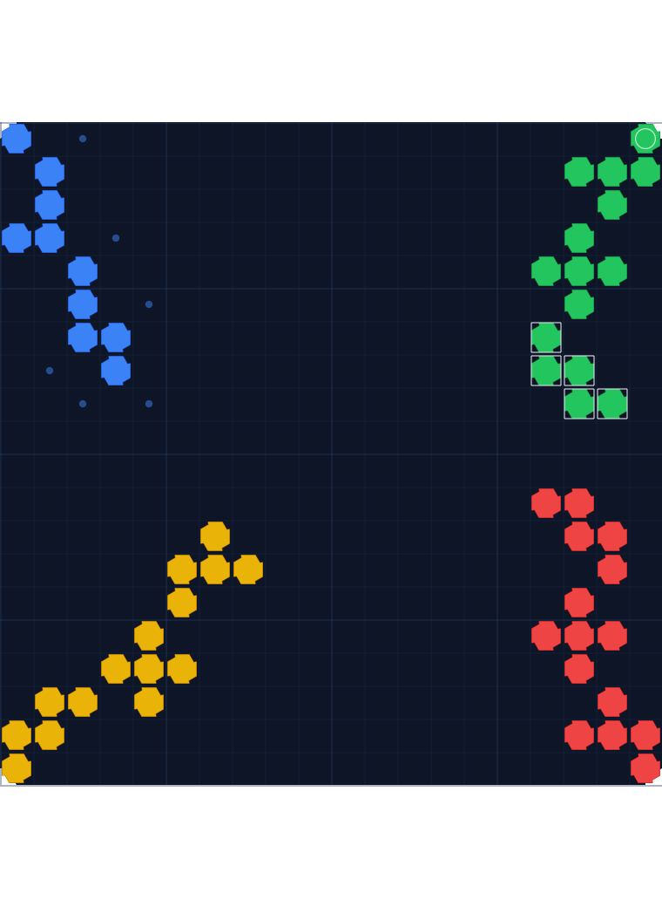
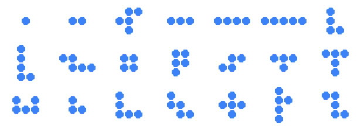

# 角斗士棋 · 多人在线（Blokus Online）

一款**零依赖**的多人联机角斗士棋（Blokus）。四个朋友各自用手机浏览器点开一个链接就能进房间开打，
支持 **四人混战** 与 **二对二** 两种模式、**AI 补位**、完整的规则引擎与积分系统。

- 后端：Node 内置 `http` + **手写的 RFC 6455 WebSocket**（没有 `ws`、没有 `socket.io`）
- 前端：原生 ES Module + Canvas，**没有构建步骤**、没有打包器
- 总共 **0 个 npm 依赖** —— 把文件夹拷到任何装了 Node 18+ 的机器上就能跑
  （开发与测试在 Node 24 上验证；`test/ui.test.js` 会挡住误用 Node 20+ 专有 API 的改动）

```
21 块棋子 / 89 格 / 91 种朝向    20×20 棋盘    4 个起始角    逆时针轮转
```

---

## 一、30 秒跑起来

```bash
cd Blokus
npm start                 # 或者： node server/index.js
```

终端会打印出可以访问的地址：

```
  本机访问：   http://localhost:3000/
  局域网访问： http://192.168.1.23:3000/   ← 手机连同一 WiFi 用这个
```

用手机浏览器打开「局域网访问」那个地址即可。

改端口 / 监听地址：

```bash
PORT=8080 node server/index.js
HOST=127.0.0.1 PORT=8080 node server/index.js
```

---

## 二、怎么让它上线

先说清楚一件事，因为这决定了你该选哪个：

| | 谁在跑服务 | 你的电脑关了还能玩吗 |
|---|---|---|
| **场景 A** 同一 WiFi | 你的电脑 | ❌ 不能 |
| **场景 C** 内网穿透 | 你的电脑 + 一条隧道 | ❌ 不能（隧道随进程一起断） |
| **场景 B** 云服务器 | 服务器 | ✅ 能 |
| **场景 D** Render 托管 | Render | ✅ 能 |

**想要「不依赖任何自己的设备、一直在线」，就得走 B 或 D。**
A 和 C 都只是「你自己电脑当服务器」，区别只是别人怎么连进来。

房间是**房间号制**的。创建房间后点「分享邀请链接」，会得到这样的链接：

```
https://你的地址/?r=A7KQ
```

**任何人点开就直接在这个房间里**（没存过昵称的话，填个昵称点一下「加入」即可）。
在 HTTPS 下分享会调起手机系统原生的分享面板，可以直接甩进微信/QQ 群
（纯 HTTP 下浏览器禁用 `navigator.share`，程序会降级成手动复制，能用但不够顺手）。

### 场景 A：大家在一起 / 同一个 WiFi（最简单，但要开着电脑）

```bash
npm start
```

把 `http://<局域网IP>:3000/?r=房号` 发到群里。
局限：手机必须和这台电脑在同一个 WiFi 下；电脑不能关。

> 如果手机打不开，八成是 Windows 防火墙。管理员 PowerShell：
> ```powershell
> netsh advfirewall firewall add rule name="Blokus 3000" dir=in action=allow protocol=TCP localport=3000
> ```
> 另外 `10.x` / `192.168.x` 这类网络如果开了「AP 隔离」，手机和电脑也互相连不通。

### 场景 B：云服务器（**推荐：真正不依赖你的设备**）

任意一台有公网 IP 的 Linux 机器（国内云厂商的轻量服务器、Oracle 永久免费实例都行）。

**方式一：Docker Compose（最省事，自带 HTTPS）**

```bash
# 在有公网 IP、域名已解析到它的服务器上
git clone <你的仓库> blokus && cd blokus
echo "BLOKUS_DOMAIN=blokus.example.com" > .env
docker compose up -d
```

就这样。Caddy 会自动申请并续期 Let's Encrypt 证书，
**而且它默认就会正确转发 WebSocket 升级** —— 不用像 Nginx 那样手写 `Upgrade` 头。

没有域名只想用 IP + 端口：

```bash
docker compose up -d blokus     # 然后访问 http://<服务器IP>:3000
```

**方式二：不用 Docker，直接用 systemd（脚本全自动）**

```bash
scp -r Blokus user@your-server:/tmp/blokus
ssh user@your-server
cd /tmp/blokus && sudo bash deploy/vps-setup.sh
```

这个脚本会：装 Node 22（如果太旧）→ 建一个无登录权限的专用用户 →
把代码锁到 `/opt/blokus` → 装 systemd 服务并开机自启 → 等它就绪并自检 →
放行防火墙 → 最后打印访问地址。

装完就是一个常驻服务，`systemctl status blokus` 看状态、
`journalctl -u blokus -f` 看日志，崩溃自动重启，跟你登不登录完全无关。

想要域名 + HTTPS，再加一步（Caddy 比 Nginx 省事得多）：

```bash
sudo apt install -y caddy
sudo caddy reverse-proxy --from blokus.example.com --to 127.0.0.1:3000
```

<details>
<summary>一定要用 Nginx 的话（注意那两个头，漏了就连不上）</summary>

```nginx
server {
    listen 443 ssl http2;
    server_name blokus.example.com;

    ssl_certificate     /etc/letsencrypt/live/blokus.example.com/fullchain.pem;
    ssl_certificate_key /etc/letsencrypt/live/blokus.example.com/privkey.pem;

    location / {
        proxy_pass http://127.0.0.1:3000;
        proxy_http_version 1.1;
        proxy_set_header Upgrade    $http_upgrade;   # ← WebSocket 必需
        proxy_set_header Connection "upgrade";       # ← WebSocket 必需
        proxy_set_header Host       $host;
        proxy_set_header X-Real-IP  $remote_addr;
        proxy_read_timeout 3600s;                    # 别让长连接被掐断
    }
}
```
</details>

### 场景 D：Render 免费托管（不买服务器，推到 GitHub 点一下就行）

项目里带了 `render.yaml` 蓝图：

1. 把仓库推到 GitHub
2. 打开 https://dashboard.render.com/blueprints → **New Blueprint Instance**
3. 选这个仓库 → **Apply**

Render 会读 `render.yaml`、用 `Dockerfile` 构建，给你一个
`https://xxx.onrender.com` 地址。之后每次 push 自动重新部署。
**你的电脑关机也照常运行。**

> ⚠️ 免费版两个要注意的：
> 1. **15 分钟没有流量会休眠**，下一个人打开要等约 30 秒冷启动。
>    想让开局不卡，用 UptimeRobot 之类的免费监控每 5 分钟 ping 一次
>    `/healthz`，正好卡在休眠阈值内。
> 2. **休眠会丢掉内存里的房间**，正在进行的对局会没。约局中间别晾太久。

### 场景 C：内网穿透（最快能开打，但依赖你的电脑）

**推荐直接用项目自带的一键脚本**，它会自动下载 cloudflared、起服务器、开隧道、
再把地址自检一遍：

```powershell
powershell -ExecutionPolicy Bypass -File .\start-public.ps1
```

跑完会直接打印可以发群里的链接：

```
  ════════════════════════════════════════════
   房间已开好，把下面这个链接发到群里：

   https://somewhere-cycle-specials-myers.trycloudflare.com

   别人点开 → 填个昵称 → 建房或输房号 → 开打
  ════════════════════════════════════════════
```

想手动来也可以，就两步：

```bash
npm start                                                          # 1. 跑游戏

cloudflared tunnel --url http://localhost:3000 --protocol http2    # 2. 另开终端起隧道
```

几点说明：

- **`--protocol http2` 建议加上。** cloudflared 默认走 QUIC（UDP），
  部分网络会污染 UDP，加这个参数强制走 TCP/HTTP2 更稳。
- 下载 cloudflared 如果 GitHub 直连不通，脚本已经自动改走镜像
  `https://gh-proxy.com/...`；手动下载同理。
- **刚拿到的地址别立刻用。** Cloudflare 快速隧道的 DNS 要几秒到几十秒才生效，
  这期间访问会 `ENOTFOUND`。脚本里已经做了重试（最多 15 次 × 6 秒），
  手动开的就自己等一会儿再试。
- **快速隧道是临时的**：关掉 cloudflared，地址立刻失效，下次启动会换新地址。
  官方也明确说「不保证可用性」。想长期稳定，要么用有账号的 named tunnel，
  要么就上一台公网服务器（场景 B）。
- **没有鉴权**：拿到链接的人都能进，别往公开地方贴。
- 好处是它给了 **HTTPS**，手机上就能用系统原生分享面板，复制链接也正常。
- 也可以用 SSH 反向隧道免下载，例如
  `ssh -R 80:localhost:3000 nokey@localhost.run`。但这类服务入口常在海外、
  连通性看运气（实测这个网络下它的 HTTPS 面连不通，而 Cloudflare 香港节点很好）——
  所以拿到地址后**一定**先跑一次下面的自检，通不过就别发给别人。

### 部署完先自检，别直接把链接发出去

```bash
node tools/check-deploy.js https://xxxx-xxxx.trycloudflare.com
```

它会走**真实 URL** 把静态资源、**WebSocket 升级**、建房 / 加入 / 开局 / 落子 /
两端状态一致性全部验一遍。反向代理少写 `Upgrade`/`Connection` 头、
证书有问题、隧道只通 HTTP 不通 WS —— 这些「出了本机才有」的毛病它都能抓到。

```
[1] HTTPS / 静态资源
  ✓ /  200  7868 字节
  ✓ /shared/rules.js  200  11453 字节
[2] WebSocket（反向代理最容易坏的就是这里）
  ✓ WebSocket 升级成功（wss 握手通过）
[3] 联机流程
  ✓ 建房成功，房号 NZ5E
  ✓ 落子成功并被服务端确认（moveCount 0 → 1）
  ✓ 两个客户端看到的棋盘完全一致（广播正常）
部署自检全部通过 ✓
```

---

## 三、玩法规则

1. **四位玩家各执一色，按逆时针顺序轮流下棋。**
   座位顺序（屏幕上的逆时针）：左上蓝 → 左下黄 → 右下红 → 右上绿。

2. **每人第一枚棋子必须盖住自己那一角的起始点。**

3. **之后每一枚新棋子，至少要有一个角与自己的棋子角对角相接；
   同一颜色的棋子之间不能边边相邻。与其他颜色没有任何接触限制**（可以随便贴着别人下）。

4. **轮到某位玩家却无处可下时，他当轮弃权**；当所有还能下棋的玩家都下不动时，本局结束。
   已经把手上的牌下完的玩家自动退场，剩下的人可以继续单独下完。

### 棋子

标准 Blokus 全套 21 枚、共 89 格：1 格 ×1、2 格 ×1、3 格 ×2、4 格 ×5、5 格 ×12。
棋子是双面的，所以界面上「旋转」和「翻转」是两个不同的按钮。

### 计分

**四人混战**

| 名次 | 增减分 |
|---|---|
| 第 1 名 | **+3** |
| 第 2 名 | **+1** |
| 第 3 名 | **0**（分数不变） |
| 第 4 名 | **−2** |

- 按占格数排名，最多者获胜。
- **占格数相同时，后手（座位号更大）排名更高。**
- **统治力奖励**：头名领先第二名达到阈值，额外 **+1**。
- **全清奖励**：头名把 21 块全部下完，额外 **+1**。
- 两项可以叠加。

**二对二**

- 对角的两人为一队：**左上蓝 + 右下红** 一队，**左下黄 + 右上绿** 一队。
- 占格总数多的一队获胜；**总数相同时，后手的一队获胜。**
- 胜方每人 **+2**，败方每人 **−1**。
- 表现特别强的胜方玩家（领先达标 / 全清）额外加分。

积分在房间里**跨局累加**，大厅里能看到排行榜。

---

## 四、调整积分规则（不用改代码）

在项目根目录放一个 `blokus.config.json`（可参考 `blokus.config.example.json`），服务器启动时自动读取：

```json
{
  "port": 3000,
  "aiDelayMs": 650,
  "offlineTakeoverMs": 30000,
  "scoring": {
    "base": 1,
    "ffaRankDelta": [3, 1, 0, -2],
    "teamWinDelta": 2,
    "teamLoseDelta": -1,
    "domination": { "enabled": true, "ffaGap": 10, "teamGap": 20, "points": 1 },
    "fullClear":  { "enabled": true, "points": 1 }
  }
}
```

### 关于统治力奖励的阈值：这是按实测数据标定的

项目里带了自对局模拟器，可以自己跑：

```bash
node tools/sim.js 60 normal ffa      # 60 局四人混战
node tools/sim.js 40 normal team     # 40 局二对二
node tools/sim.js 20 hard ffa        # 高难度 AI
```

实测（100 局 AI 自对局）头名领先第二名的幅度分布：

| 模式 | p50 | p90 | p95 | 最大 | 阈值 20 格的触发率 |
|---|---|---|---|---|---|
| 四人混战 | 4 | 9 | 11 | **12** | **0%** |
| 二对二 | 8 | 20 | 25 | 28 | 10% |

**关键结论：四人混战是贴身肉搏，头名最多也就领先 12 格。**
如果混战也沿用 20 格阈值，这条奖励 100 局触发 0 次，等于一条死规则。
所以程序默认把混战阈值定在 **10 格**（约 8% 触发率），与二对二 20 格阈值（约 10%）的稀有度基本一致。

想改成别的数值，只改上面那个 JSON 即可。

---

## 五、界面上怎么操作

**大厅**

- **点空座位坐下 —— 座位就决定了你的颜色和逆时针的出牌顺序**：
  左上蓝（先手）→ 左下黄 → 右下红 → 右上绿。再点一次自己的座位可以起身。
- 房主：点 AI 座位可以把它收回成空位；可以切模式、切 AI 难度、点「开始游戏」。
- **人数不满也能直接开局，空位会自动补成 AI。**
- 「分享邀请链接」会把 `?r=房号` 的链接通过系统分享面板发出去。
  链接会记住你的昵称（存在浏览器本地），下次点开自动进房。

**对局**

- **单指拖动** = 平移棋盘；**双指捏合** = 缩放；双击/滚轮也能缩放（鼠标）。
- 点下方棋子栏选中一枚棋子 → 棋盘上出现半透明的「影子棋子」。
- **单指拖动影子**移动位置，**松手自动吸附**到最近的合法位置（可以关掉「自动吸附」）。
- 轻点棋盘 = 影子直接跳过去。
- `↻ 旋转` / `⇋ 翻转` 换朝向；`✓ 落子` 提交；`✕ 取消` 取消选择。
- 半透明的小方块 = 这枚棋子当前朝向所有**能放的位置**；同色小圆点 = 你的**角接点**。
- 右上角 `☰` 打开计分板（含最近动作战报），`?` 打开规则速查。

**掉线了怎么办**

- 前端会自动重连并**自动坐回原来的座位**（身份存在浏览器 localStorage 里）。
- 如果轮到某个掉线的人，**30 秒后服务端会自动托管**替他走一手，整局不会卡死。
  这个时间也能用 `offlineTakeoverMs` 调。

---

## 六、项目结构

```
Blokus/
├─ server/
│  ├─ index.js       启动入口（读配置、监听端口、打印局域网地址）
│  ├─ app.js         HTTP + WebSocket 应用工厂（静态托管、路由、心跳）
│  ├─ ws.js          手写的 RFC 6455 WebSocket 服务端（握手 / 分帧 / 掩码 / ping-pong）
│  ├─ rooms.js       房间、座位、对局流程、AI 调度、离线托管、会话积分
│  └─ config.js      读取 blokus.config.json 与环境变量
├─ shared/           ★ 服务端与浏览器共用同一份源码
│  ├─ constants.js   棋盘规格、座位/颜色、阵营划分、默认积分
│  ├─ pieces.js      21 枚棋子 + 全部旋转/翻转朝向 + 镜像映射
│  ├─ rules.js       棋盘状态、落子合法性、轮转、弃权、终局、序列化
│  ├─ scoring.js     混战/二对二排名、后手优先、统治力与全清奖励
│  ├─ ai.js          合法着法枚举 + 启发式评分 + 一层前瞻
│  └─ protocol.js    客户端↔服务端消息类型
├─ public/
│  ├─ index.html     三个界面：首页 / 房间大厅 / 对局
│  ├─ style.css      移动优先的深色样式
│  ├─ board.js       Canvas 棋盘渲染 + 触屏交互（拖动/缩放/吸附）
│  └─ app.js         连接、大厅、对局 UI 与消息处理
├─ test/             105 个测试，见第七节
│  ├─ *.test.js      八个测试文件（棋子 / 规则 / 计分 / 配置 / 界面 / WebSocket / 房间 / 前端 e2e）
│  ├─ wsclient.js    独立实现的测试用 WebSocket 客户端（用来校验服务端）
│  ├─ domstub.js     极简 DOM/Canvas 桩 + 迷你 HTML 解析器
│  ├─ web-loader.js  把前端的 '/shared/...' 这类 import 映射到磁盘路径
│  └─ helpers.js     测试用的局面搭建工具
├─ tools/
│  ├─ sim.js            自对局模拟器（用于标定积分阈值）
│  ├─ smoke.js          对运行中的服务器做端到端冒烟检查
│  ├─ check-encoding.js 源码编码自检（中文项目必查）
│  ├─ render-preview.js 录制真实 Canvas 绘制指令并重放成 PNG
│  ├─ verify-render.js  把重放出来的 PNG 与真实对局状态逐格比对
│  ├─ check-deploy.js   对已部署的公网地址做端到端自检（含 wss）
│  ├─ raster.js         零依赖的 Canvas 2D 光栅化器
│  ├─ png.js / pngread.js  PNG 编解码（只用内置 zlib）
├─ art/              渲染预览产物（board.png / tray.png / board.svg）
├─ deploy/
│  ├─ vps-setup.sh      在一台新服务器上一键装成 systemd 常驻服务
│  ├─ blokus.service    systemd 单元（含只读文件系统等安全加固）
│  └─ Caddyfile         Caddy 反代配置（自动 HTTPS + 自动转发 WebSocket）
├─ Dockerfile         生产镜像（零依赖，无 npm install 步骤）
├─ docker-compose.yml 游戏 + Caddy 一条命令拉起
├─ render.yaml        Render.com 一把梭蓝图
├─ start-public.ps1   Windows 上开临时公网隧道（依赖本机，仅供快速开局）
├─ blokus.config.example.json   积分规则示例（复制成 blokus.config.json 即生效）
└─ .gitignore / .gitattributes  后者负责锁死换行符，别删
```

### 为什么前端要直接引用 `/shared/`

服务端把 `shared/` 目录原样托管给浏览器（`/shared/*.js`）。于是**同一份规则引擎**
既在服务端做权威校验，也在浏览器里做本地预演（高亮能放的位置、灰显放不下的棋子）。
两边永远不会出现规则不一致的问题。

---

## 七、测试

```bash
npm test
```

> 如果 `npm test` 报 `spawn EPERM`（常见于受限沙箱/某些 CI），说明环境不允许
> 测试运行器用管道 spawn 子进程。改成在**同一个进程内**跑即可：
> ```bash
> npm run test:inproc
> ```

**105 个测试，全部通过**（`npm run test:inproc` 约 10 秒跑完）：

| 文件 | 数量 | 覆盖内容 |
|---|---|---|
| `test/pieces.test.js` | 12 | 21 块 / 89 格 / 91 朝向；各棋子对称性；朝向不重复；镜像映射是对合运算 |
| `test/rules.test.js` | 24 | 首子占角、同色只能角对角、**同色边接触被禁 vs 异色边接触放行**（同几何对照）、逆时针轮转、弃权与终局、序列化往返、整局自对局一致性 |
| `test/scoring.test.js` | 22 | 名次与增减分、**同分后手优先**、统治力/全清奖励、阈值与开关可配置、二对二组队计分 |
| `test/config.test.js` | 7 | `blokus.config.json` 的读取、嵌套覆盖、环境变量优先级、损坏文件回退、注释键剔除 |
| `test/ui.test.js` | 10 | **HTML/CSS/JS 的静态一致性**：JS 引用的 id 都存在、id 不重复、`hidden` 兜底规则、外链 CDN 检查、Canvas API typo 检查、Node 18 兼容性守卫 |
| `test/ws.test.js` | 14 | 用**独立实现**的客户端校验握手应答值（对上 RFC 6455 官方向量）、7/16/64 位长度、分片拼装、ping/pong、掩码缺失报 1002、超长报 1009 |
| `test/room.test.js` | 15 | 建房/加入/座位/房主权限/聊天；**两个真实 WebSocket 客户端把整局打完**；非法落子不被接受；离线托管 |
| `test/web.test.js` | 1 | **加载真实 `index.html` + `app.js` + `board.js`**，连真实服务器，全程只点 UI，把混战和二对二各打完一整局并校验结算浮层 |

（`web.test.js` 在 `node --test` 里记成 1 个顶层测试，内部含几十条断言。）

`test/web.test.js` 值得一提：它自己带了一个极简的 DOM/Canvas 桩（`test/domstub.js`，内含一个
能解析 `index.html` 的迷你 HTML 解析器）和一个模块解析钩子（`test/web-loader.js`），
所以能在**没有浏览器**的环境下真实加载并运行前端代码。

`test/ui.test.js` 拦的是另一类问题。举个真实踩到的坑：`hidden` 属性只靠浏览器默认样式的
`display:none` 生效，而 `.conn-bar { display:flex }` / `.modal { display:grid }` 这种作者样式
优先级更高，会把 `hidden` 顶掉 —— 结果是**连接条和结算浮层永远显示在屏幕上**。
这个测试会在有人删掉样式表里的 `[hidden] { display: none !important }` 兜底规则时立刻报错。

### 另外两个自检工具

```bash
node tools/check-encoding.js             # 全部源码是否为无 BOM 的合法 UTF-8（中文项目必查）
node tools/smoke.js                      # 对运行中的服务器做端到端冒烟检查
node tools/smoke.js 10.0.0.5:8080        # 也可以检查远程服务器
```

`smoke.js` 会检查静态资源、路径穿越防护、`/api/config`，并用两条真实 WebSocket 连接把一整局打完核对结算。
两个一起跑：`npm run check`。

### 渲染预览与逐格核对：把真实绘制指令重放成图片

```bash
npm run render            # 等价于下面两条
node tools/render-preview.js   # 录制真实绘制指令 → art/*.png
node tools/verify-render.js    # 把 PNG 的像素与真实对局状态逐格比对
```

`render-preview.js` 会：起一个真实服务器 → 加载真实前端 → 让 AI 走若干手 →
**录制 `board.js` 发出的每一次 Canvas 绘制调用** → 用一个自己写的零依赖光栅化器
（`tools/raster.js` + `tools/png.js`）把它们重放成 PNG。

所以下面的图**不是手画的示意图**，而是前端渲染代码的真实输出：



`verify-render.js` 再反过来把 PNG 解码回来，逐格核对：

```
== A. art/board.png 与对局状态逐格比对 ==
  ✅ 棋盘右边界在 x≈760（实际 760.00，即占满画布宽度）
  采样 400 格；像素判色计数 蓝10 黄15 红15 绿15
  ✅ 逐格颜色计数与状态快照完全一致（不一致 0 格）
  ✅ 座位 0 的起始角 (0,0) 中心像素是座位色 rgb(59,130,246)
  ...（四个起始角逐一核对）
== B. art/tray.png 与 shared/pieces.js 定义逐枚比对 ==
  ✅ 21 枚棋子的形状/朝向与 pieces.js 定义完全一致（实际 21/21）
  ✅ 棋子栏合计 89 格（标准 Blokus 全套 = 89 格）
✅ 全部检查通过
```

也就是说：**棋盘上 400 个格子的渲染颜色与游戏状态逐格一致**，
**21 枚棋子预览的形状与 `pieces.js` 的定义逐格一致**。
这是对「渲染代码是否忠实反映状态」最直接的一道保险。



> 光栅化器是测试辅助工具，对圆角矩形的处理是近似的，所以图里的棋子看起来像
> 八边形而不是圆角方块 —— 这是重放工具的简化，不是前端代码的问题。
> 上面这些 PNG 和 `art/json/` 是录制产物（后者已在 `.gitignore` 里），
> 拉下代码后跑一次 `npm run render` 就会重新生成。

---

## 八、常见问题

**手机打不开 `http://192.168.x.x:3000/`？**
1. 确认手机和电脑在同一个 WiFi（不是手机流量）。
2. Windows 防火墙可能拦了 Node，放行一下入站连接。
3. 确认服务器是监听 `0.0.0.0`（默认就是），不是只监听 `127.0.0.1`。

**「分享邀请链接」点了没反应？**
HTTP 下浏览器禁用 `navigator.share`/`navigator.clipboard`，程序会降级成
选中文本或弹窗让你手动复制。用 HTTPS 就能用原生分享面板。

**房号输错了？**
房号是 4 位，字符集刻意去掉了容易看错的 `I O 0 1`。

**服务器重启后房间没了？**
房间和对局状态都存在内存里，重启即清空。这对「约一局」的场景够用；
要长期保存积分需要自己接数据库。

**能加多少人？**
每个房间固定 4 个座位（这是 Blokus 的规则），但**旁观者不限**，
旁观的人能看到实时棋盘和聊天。多开几个房间就能容纳更多人。

---

## 九、许可

仅供学习与自娱自乐使用。Blokus 是 BoardGameBliss / Mattel 的注册商标，
本项目是一个独立实现的非商业克隆。
